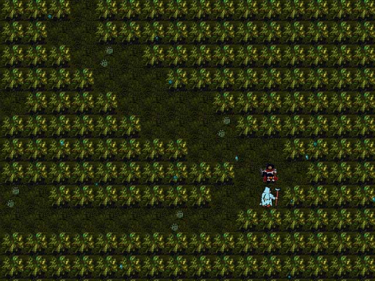
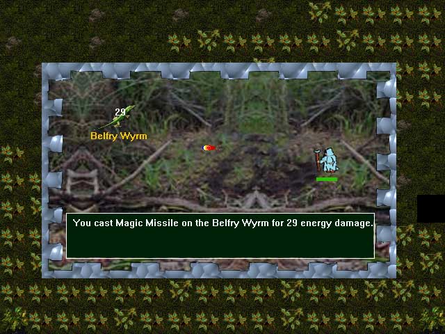
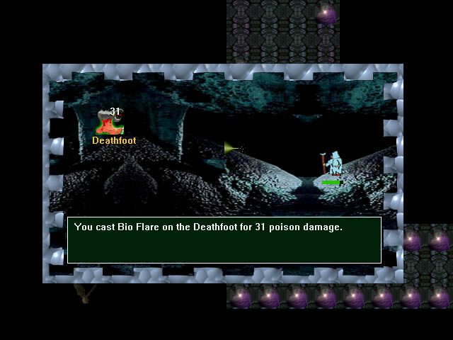
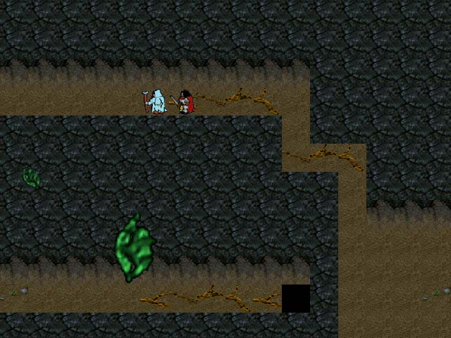
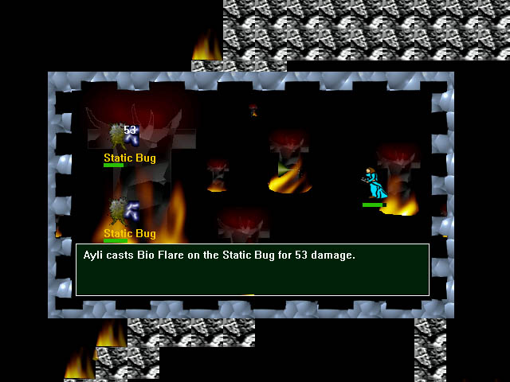
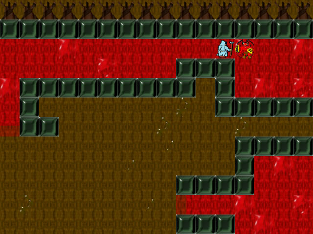

Cryn the Dark Reflection
========================

Cryn - The Dark Reflection: an RPG role playing game.

## Screenshots













## Story

Life is but a short time, and existence is always temporary.
As the son of a king, you know that one day you will have
great power. However, this power is shared between you
and your brother.. although very much different, you are also the same. 

United by a common bond, you assume the role of the younger
brother, Cryn, as he finds himself caught in an unknown
path along with his older brother, Beorne.

Cryn - The Dark Reflection is an RPG role playing game.

## Features

- Classic RPG feel of Final Fantasy, Zelda, Dragon Warrior.
- Bird's eye view of over-world.
- Weather effects including sun, rain, fog, and more. 
- More than 50 different random monster encounters and pre-set boss encounters.
- Turn-based battle system using physical attacks, offensive, and defensive magic.
- More than 15 different spells.
- Spell evolution occurring at level 10+.
- Unique monster spells and NPC attacks.
- Some NPC characters can be controlled by user during battle.
- Switch between multiple view points in game and control different character missions. 
- Game may be saved at any time to restore from last save point.
- Over 40 minutes of FREE demo game play.
- Over 100 minutes of full version game play.  

Since this is an RPG game, you should not expect to play it once and
beat the game the first time around. You should SAVE your game very often!
I repeat! Save your game often! If you die, it's OK. Just restart your game
and now you'll be that much smarter next time in battle.


## Requirements

- You must have Direct X installed on your machine. You can download Direct X from Microsoft at http://www.microsoft.com/directx


## Controls

Arrow Keys  : Move
Space/Enter : Talk
F10         : Menu, Save, Quit

## Map

```
Castle ---> Forest
              |
              |
              |
              |
     Swamp <---
       |
       |
       |
       ---> Cave ---> Ancient Tree ---> ???
```

## Spells

All spells are gained on a per level basis. You begin with only 2 spells and
learn more as you progress. Each time you level, your Hit Points, Magic Points,
Weapon Power, Armor, and Spell increase. Spells begin evolving after level 10.

- Magic Missile : A bolt of energy is dispersed from your fingers.
- Cure          : Heals gradually increasing amounts of hit points.
- Crystal Clear : Enhances your brain's perceptors to know all about your enemy and hit points.
- Bio Flare     : Emits a foul poison gas spray towards your enemy.
- Light Shock   : A massive flare fires from your hands dealing light damage.
- Mind Numb     : Reduces the mind of enemy to that of a basic animal.
- Lightning     : A huge bolt of electricity is called forth to smite your enemy.
- Fire          : Envelops your enemy in a massive burning flame.
- Fluxal Melt   : ???
- many More ...

## Building the Project for Developers

This game was created using [CDX](https://sourceforge.net/projects/cdx/), a gaming library that is no longer maintained, but is included in this project. You may also need to dowload and install the [Microsoft Platform SDK](https://developer.microsoft.com/en-us/windows/downloads/sdk-archive/) if it is not pre-installed with your copy of **Visual Studio 2022**.

### Install Software

1. Download Visual Studio Community 2022 https://visualstudio.microsoft.com/vs/community/
2. Download DirectX 7 SDK and install folder in C:\ https://archive.org/details/dx7sdk-7001

### Configure Project Directories

1. Open project in VS Studio Community.
2. Right-click the project name Cryn The Dark Reflection and select Properties.
3. Click the C/C++ item and click General.
4. Under "Additional Include Directories" click in the textbox, click the dropdown arrow, select Edit.
5. Click the "Add" toolbar icon and enter: `bass;C:\dx7sdk-700.1\include`
6. Click the "Linker" item and click General.
7. Under "Additional Library Directories" click in the textbox, click the dropdown arrow, select Edit.
8. Click the "Add" toolbar icon and enter: `bass;C:\dx7sdk-700.1\lib`
9. Under "Configuration Properties", select "VC++ Directries", under "Include Directories", enter `C:\dx7sdk-700.1\include;cdx\include`
10. Under "Configuration Properties", select "VC++ Directries", under "Library Directories", enter `C:\dx7sdk-700.1\lib`
11. Under "Linker", select "Input", in "Additional Dependencies", enter `ddraw.lib;dsound.lib;dxguid.lib;dinput.lib;winmm.lib;kernel32.lib;user32.lib;gdi32.lib;winspool.lib;comdlg32.lib;advapi32.lib;shell32.lib;ole32.lib;oleaut32.lib;uuid.lib;odbc32.lib;odbccp32.lib;bass.lib;legacy_stdio_definitions.lib`
12. Repeat for "All Platforms" in top dropdown, or select x86 and x64.
13. In the properties, select C/C++, select Preprocessor, under Preprocessor Definitions add _CRT_SECURE_NO_WARNINGS, _SCL_SECURE_NO_WARNINGS
14. Ignore LIBC.lib: You can ignore LIBC.lib in your project settings. Go to Project -> Properties -> Configuration Properties -> Linker -> Input -> Ignore Specific Library, and add LIBC.lib12.
15. Select Build->Build Solultion.

### Configure Sound

To get bass.lib, bass.dll, and bass.h working in Visual Studio Community 2022, you can follow these steps:

1. Place the Files: Create a directory (for example, `bass`) under your solution directory and copy bass.lib, bass.dll, and bass.h into this directory.
2. Add to Linker Input: Add bass.lib to the linker input. You can do this by going to Project Properties -> Linker -> Input -> Additional Dependencies and adding bass.lib and cdx.lib.
3. Add to Additional Library Directories: Add the path to the .lib file (which is the directory you created in step 1) in Additional Library Directories in the linker section2. You can do this by going to Project Properties -> Linker -> General -> Additional Library Directories.
4. Include bass.h: Include bass.h in your .cpp file by adding #include "bass.h" at the top of your file2.
5. Add to Additional Include Directories: Add the directory where bass.h is located (which is the directory you created in step 1) to Additional Include Directories. You can do this by going to Project Properties -> C/C++ -> General -> Additional Include Directories2.
6. Ensure DLL is in Executable Directory: Make sure that bass.dll is in your project executable directory (for example, the Debug or Release folder) so that it can be found when your program runs3.
7. Also ensure Linker/Input has "Add Module to Assembly" `bass\bass.lib`
